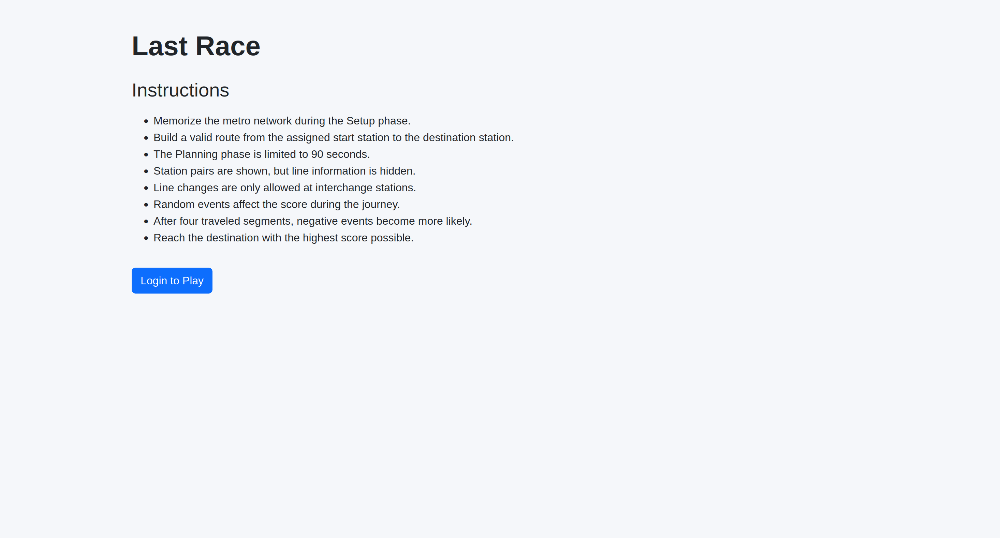
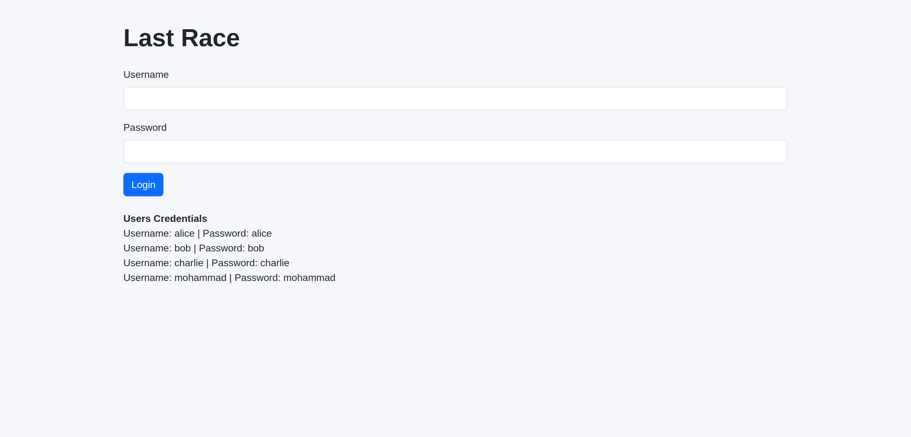
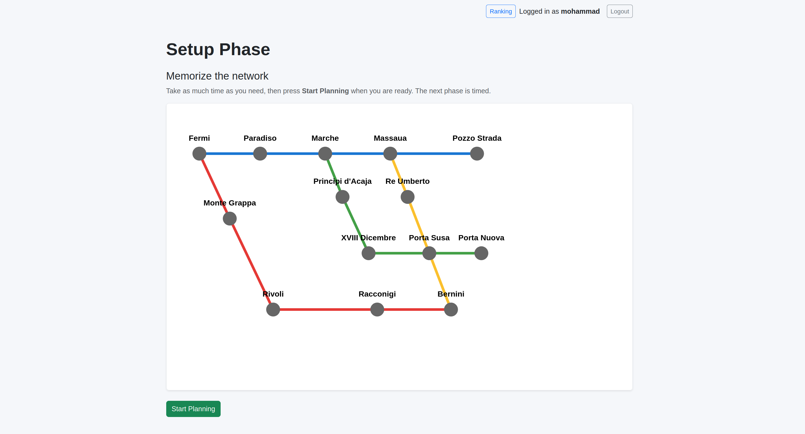
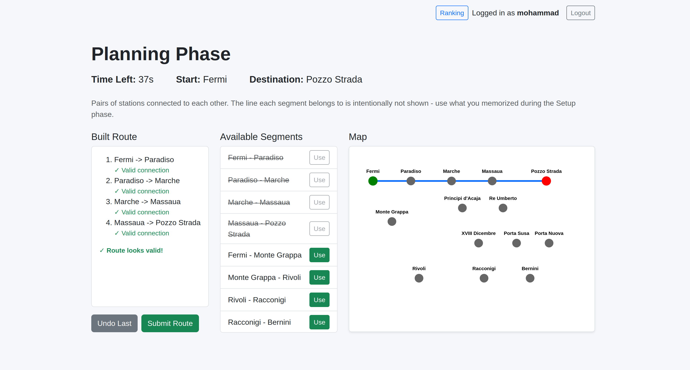
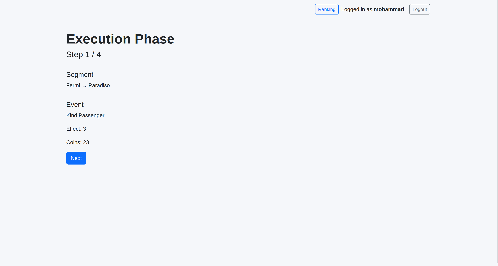
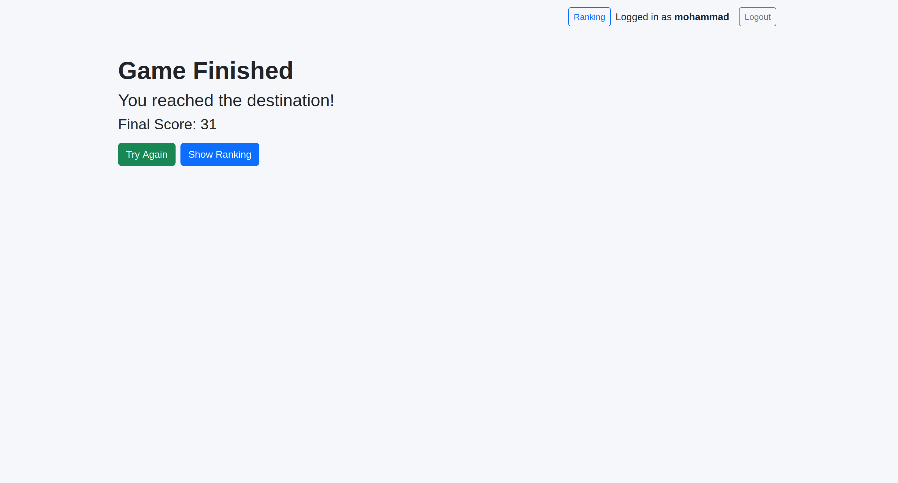
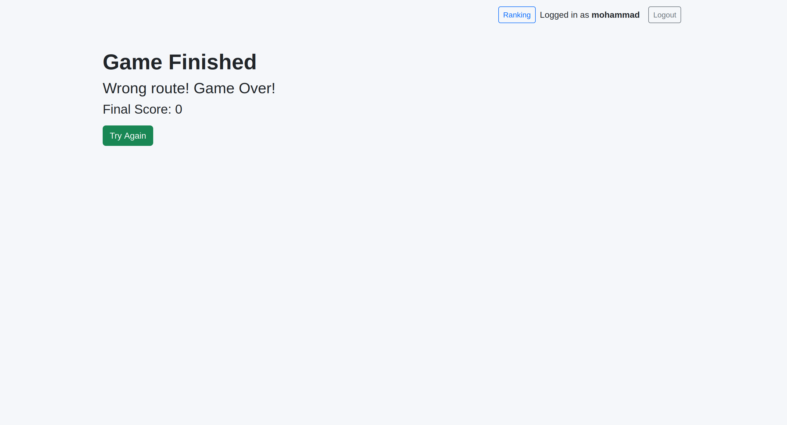
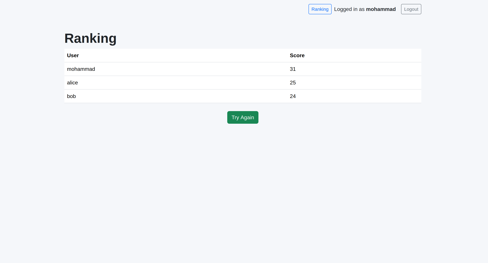

# Exam #1: "Last Race"

## Student: s360056 NEMATI MOHAMMAD

## React Client Application Routes

* Route `/`: Instructions page. Anonymous users can read the game rules and authenticated users can start a new game.
* Route `/login`: Login page used to authenticate registered users.
* Route `/setup`: Setup phase. Displays the complete metro network map so the player can memorize stations, connections and lines.
* Route `/planning`: Planning phase. Displays the start station, destination station and the list of available segments. The player must build a valid route before the 90-second timer expires.
* Route `/execution`: Execution phase. Shows the journey step-by-step and displays the random event associated with each traveled segment.
* Route `/result`: Displays the final game result and score.
* Route `/ranking`: Displays the global ranking containing the best score achieved by each registered user.

## API Server

* POST `/api/sessions`

  * Request body: `{ username, password }`
  * Authenticates a user and creates a session.
  * Response body: authenticated user object.

* GET `/api/sessions/current`

  * No parameters.
  * Retrieves the currently authenticated user.
  * Response body: user object.

* DELETE `/api/sessions/current`

  * No parameters.
  * Destroys the current session.
  * Response body: empty.

* GET `/api/network`

  * No parameters.
  * Retrieves the complete metro network including line information.
  * Response body: list of network segments.

* GET `/api/segments`

  * No parameters.
  * Retrieves all station pairs used during the Planning phase.
  * Response body: list of available segments.

* POST `/api/game/start`

  * No parameters.
  * Creates a new game and randomly selects a valid start station and destination station.
  * Response body: start station and destination station.

* POST `/api/games`

  * Request body: { route: [{ station1, station2 }, ...] }
  * Validates the route, executes random events and computes the final score.
  * Response body: validation result, execution steps and final score.

* GET `/api/ranking`

  * No parameters.
  * Retrieves the best score achieved by each registered user.
  * Response body: ranking list.

## Database Tables

* Table `users` - stores registered users together with password hashes and salts used for authentication
* Table `stations` - stores all metro stations.
* Table `lines` - stores metro line names.
* Table `segments` - stores station connections and their associated line.
* Table `events` - stores all random game events and their score effects.
* Table `games` - stores completed games and final scores.

## Main React Components

* `App` (in `App.jsx`): Main application component containing route definitions.
* `AuthProvider` (in `AuthContext.jsx`): Manages authentication state and user session information.
* `ProtectedRoute` (in `ProtectedRoute.jsx`): Prevents access to protected pages by anonymous users.
* `Header` (in `Header.jsx`): Displays user information, logout button and ranking navigation.
* `MetroMap` (in `MetroMap.jsx`): Renders the interactive metro network map using SVG.
* `metroMapData` (in `metroMapData.js`): Contains station coordinates and visual layout data for the metro map.
* `InstructionsPage` (in `InstructionsPage.jsx`): Displays game instructions.
* `LoginPage` (in `LoginPage.jsx`): Handles user authentication.
* `SetupPage` (in `SetupPage.jsx`): Displays the metro network during the memorization phase.
* `PlanningPage` (in `PlanningPage.jsx`): Handles route construction and timer management.
* `ExecutionPage` (in `ExecutionPage.jsx`): Displays route execution and random events.
* `ResultPage` (in `ResultPage.jsx`): Displays the final score.
* `RankingPage` (in `RankingPage.jsx`): Displays the ranking of registered users.

# Screenshot

Instructions Page

Login Page

Setup Page

Planning Page

Execution Page

Result Page | Valid Route

Result Page | Wrong Route

Ranking Page

## Users Credentials

* alice, alice
* bob, bob
* charlie, charlie
* mohammad, mohammad

## Use of AI Tools

ChatGPT was used to review the code structure, improve documentation, generate comments, assist with debugging and verify implementation ideas. All generated suggestions were manually reviewed, adapted and tested before being integrated into the final project. The final implementation and design decisions were made by the student.
